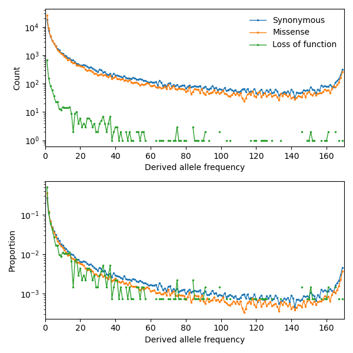

.. _sec_dfe_inferenc:

.. jupyter-execute::
    :hide-code:

    import matplotlib, matplotlib.pylab as plt
    plt.rcParams['legend.title_fontsize'] = 'xx-small'
    matplotlib.rc('xtick', labelsize=9)
    matplotlib.rc('ytick', labelsize=9)
    matplotlib.rc('axes', labelsize=12)
    matplotlib.rc('axes', titlesize=12)
    matplotlib.rc('legend', fontsize=10)

=============
DFE inference
=============
.. jupyter-kernel:: python3

By Aaron Ragsdale, November 2020.

The distribution of fitness effects (DFE) for new mutations describes is a fundamental
parameter in evolutionary biology - it determines the fixation probability of new
functional mutations, the strength of background selection, and the genetic architecture
of traits and disease.

Very roughly, most new mutations across the genome are effectively neutral or
deleterious, with a small fraction being beneficial (e.g. [Keightley]_, [Boyko]_).
In coding regions, the average selection coefficient for a new mutation depends on
its functional effect: we typically assume synonymous (or silent) mutations are
effectively neutral (though this may be a tenuous assumption!), missense (or
nonsynonymous) mutations are more deleterious on average, and loss-of-function
(or nonsense) mutations are often very damaging. We can learn about the DFE in
each of these categories by studying the distributions allele frequencies for variants
in each class.

****
Data
****

Let's first look at the data we'll be working with. Here, I used single-population data
from the Mende from Sierre Leone (MSL) from the 1000 Genomes Project [1000G]_. In
:numref:`all_data`, I plotted the unfolded SFS for three classes of mutations 
in coding regions genome-wide. We can see that the missense variants are skewed
to lower frequencies than synonymous variants, on average, and loss-of-function
(LOF) variants are skewed to even lower frequencies.

It can be difficult to judge the skew of the SFS based on SFS counts, since the total
mutational target for each mutation class differs (:numref:`mutation_rates`). In the
bottom panel of the plot, we can see that of all LOF variants observed in the MSL
population, roughly 50% of them are singletons; compare that to synonymous variants,
of which less than 30% are singletons.

.. _all_data:

    Synonymous, missense, and loss-of-function SFS from the 1000 Genomes Project
    across all autosomal genes. Top: counts in each frequency bin. Bottom: proportions
    in each frequency bin.

Mutation rates
--------------

The overall scaling of the SFS from mutation classes is also informative, because
strongly deleterious or lethal mutations are quickly lost from the population and
so are often unseen. Thus, seeing fewer mutations that expected in a given class
tells us that some fraction of those mutations are highly deleterious. To make such
an inference about the strongly damaging tail fo the DFE we need to know the
total mutation rates for each class of mutations.

Using the mutation model from [Karczewski]_, I summed across all possible mutations in
genes genome-wide, their mutational probability, and their functional consequences to
get the total mutation rate (``u*L`` - here, ``L`` is roughly 36 Mb of annotated coding
regions) for each of the three mutation classes shown in :numref:`all_data`:

.. _mutation_rates:
.. list-table:: Total mutation rates for classes of mutations in coding regions.
    :align: center

    * - Mutation class
      - Total mutation rate
    * - Synonymous variants
      - 0.1442
    * - Missense variants
      - 0.3426
    * - Loss-of-function variants
      - 0.0256

We can see here that the mutational target for nonsynonymous variants is about 2.37
times larger than for synonymous variants. Still, we see far more segregating
synonymous mutations than nonsynonymous mutations:

.. jupyter-execute::

    import moments
    import pickle
    import numpy as np

    # note that these frequency spectra are saved in the docs directory of the moments
    # repository: https://github.com/MomentsLD/moments/tree/main/docs/data
    data = pickle.load(open("./data/msl_data.bp", "rb"))

    fs_syn = data["spectra"]["syn"]
    fs_mis = data["spectra"]["mis"]
    fs_lof = data["spectra"]["lof"]

    u_syn = data["rates"]["syn"]
    u_mis = data["rates"]["mis"]
    u_lof = data["rates"]["lof"]

    print("Diversity:")
    print(f"synonymous:\t{fs_syn.pi():.2f}")
    print(f"missense:\t{fs_mis.pi():.2f}")
    print(f"loss of func:\t{fs_lof.pi():.2f}")

    print()
    print("Diversity scaled by total mutation rate:")
    print(f"synonymous:\t{fs_syn.pi() / u_syn:.2f}")
    print(f"missense:\t{fs_mis.pi() / u_mis:.2f}")
    print(f"loss of func:\t{fs_lof.pi() / u_lof:.2f}")

**************************
Controlling for demography
**************************

Demography (in this case, the population size history) affects mutation frequency
trajectories and the SFS, so we need to control for non-steady-state demography in
some way. Using our assumption that synonymous variants are effectively neutral, we
first fit a demographic model to synonymous variants, and then with that inferred
demography we fit the DFE to selected variants.

We could pick any plausible demographic model to fit. The main consideration is to
choose a demographic model that can adequately fit the data, but is not so
over-parameterized to be overfitting to the noise in the SFS. In :numref:`all_data`,
we can also see the telltale sign of ancestral misidentification by the uptick
of high-frequency variants. In addition to the demographic parameters (sizes and
epoch times), we wil also fit a parameter to account for the probability of
mis-polarizing a variant.

Let's fit a model with three epochs: the ancestral size, an ancient expansion, and a
recent exponential growth. In fitting the demography, we keep ``multinom=True``, the
default, as we don't have an estimate for :math:`N_e`.

.. code-block:: python

    def model_func(params, ns):
        nuA, nuF, TA, TF, p_misid = params
        fs = moments.Demographics1D.snm(ns)
        fs.integrate([nuA], TA)
        nu_func = lambda t: [nuA * np.exp(np.log(nuF / nuA) * t / TF)]
        fs.integrate(nu_func, TF)
        fs = (1 - p_misid) * fs + p_misid * fs[::-1]
        return fs

    p_guess = [2.0, 10.0, 0.3, 0.01, 0.02]
    lower_bound = [1e-3, 1e-3, 1e-3, 1e-3, 1e-3]
    upper_bound = [10, 100, 1, 1, 0.999]

    opt_params = moments.Inference.optimize_log_fmin(
        p_guess, fs_syn, model_func,
        lower_bound=lower_bound, upper_bound=upper_bound)

    model = model_func(opt_params, fs_syn.sample_sizes)
    opt_theta = moments.Inference.optimal_sfs_scaling(model, fs_syn)
    Ne = opt_theta / u_syn / 4

    print("optimal demog. parameters:", opt_params[:-1])
    print("anc misid:", opt_params[-1])
    print("inferred Ne:", f"{Ne:.2f}")

.. jupyter-execute::
    :hide-code:

    def model_func(params, ns):
        nuA, nuF, TA, TF, p_misid = params
        fs = moments.Demographics1D.snm(ns)
        fs.integrate([nuA], TA)
        nu_func = lambda t: [nuA * np.exp(np.log(nuF / nuA) * t / TF)]
        fs.integrate(nu_func, TF)
        fs = (1 - p_misid) * fs + p_misid * fs[::-1]
        return fs

    opt_params = np.array([2.21531687, 5.29769918, 0.55450117, 0.04088086, 0.01975812])
    model = model_func(opt_params, fs_syn.sample_sizes)
    opt_theta = moments.Inference.optimal_sfs_scaling(model, fs_syn)
    Ne = opt_theta / u_syn / 4

    print("optimal demog. parameters:", opt_params[:-1])
    print("anc misid:", opt_params[-1])
    print("inferred Ne:", f"{Ne:.2f}")
    print("Log-likelihood:", moments.Inference.ll_multinom(model, fs_syn))

Note that I initialized the model parameters fairly close to the optimal parameters.
In practice, you would want to test a wide range of initial conditions to make sure
our inference didn't get stuck at a local minimum.

We can see how well our model fit the synonymous data:

.. jupyter-execute::
    
    moments.Plotting.plot_1d_comp_multinom(model, fs_syn, residual="linear")

    # Demographic model fit to the MSL synonymous data. Top: model (red) and synonymous
    # data (blue) SFS. Bottom: residuals, plotted as ``(model - data) / sqrt(data)``.

That's a pretty good fit! Now that we have our inferred demographic model, let's
move on to inferring the DFEs for missense and LOF variants.

*****************
Inferring the DFE
*****************

Now that we have a plausible demographic model, we can move to the selected SFS.
Not every new missense mutation or every new LOF mutation will have the same
fitness effect, so we aim to learn the *distribution* of selection coefficients
of new mutations. Here, we are going to assume an additive model of selection -
that is, heterozygotes have fitness :math:`1+s` while homozygotes for the
derived allele have fitness :math:`1+2s`. We're also only going to focus
on the deleterious DFE - we assume beneficial mutations are very rare, and we'll
ignore them.

The general strategy is to pick some distribution (here, we'll choose a
`gamma distribution <https://www.wikipedia.org/wiki/Gamma_distribution>`_,
though other distributions such a log-normal or point masses could be used),
and then infer the parameters of that distribution. To do so, we compute a large
number of SFS spanning the range of the distribution of possible :math:`\gamma=2N_es`
values, and then combine them based on weights given by the parameterized DFE
(for example, [Ragsdale]_, [Kim]_).

Because the underlying demographic model does not change, we can cache the SFS
for each value of :math:`\gamma`. Then in optimizing the DFE parameters, we just
have a weighted sum across this cache, and this makes the actual DFE inference
very rapid.

Caching SFS
-----------

We cache the SFS for the inferred demography and a grid of selection coefficients
ranging from neutral to strongly deleterious. For the SFS with very deleterious
selection coefficients, the computation is only stable with large sample sizes.
Thus, after each computation for a given selection coefficient, we check to make
sure that the SFS does not have large negative oscillations and did not fail
to converge. If the computation failed, we doube the sample size and recompute
the SFS, repeating until we have a sample size large enough to stably compute
the SFS. That SFS is then projected to the needed sample size and chached.

.. code-block:: python

    def selection_spectrum(gamma, h=0.5):
        rerun = True
        ns_sim = 100
        while rerun:
            ns_sim = 2 * ns_sim
            fs = moments.LinearSystem_1D.steady_state_1D(ns_sim, gamma=gamma, h=h)
            fs = moments.Spectrum(fs)
            fs.integrate([opt_params[0]], opt_params[2], gamma=gamma, h=h)
            nu_func = lambda t: [opt_params[0] * np.exp(
                np.log(opt_params[1] / opt_params[0]) * t / opt_params[3])]
            fs.integrate(nu_func, opt_params[3], gamma=gamma, h=h)
            if abs(np.max(fs)) > 10 or np.any(np.isnan(fs)):
                # large gamma-values can require large sample sizes for stability
                rerun = True
            else:
                rerun = False
        fs = fs.project(fs_syn.sample_sizes)
        return fs

    spectrum_cache = {}
    spectrum_cache[0] = selection_spectrum(0)

    gammas = np.logspace(-4, 3, 61)
    for gamma in gammas:
        spectrum_cache[gamma] = selection_spectrum(-gamma)

.. jupyter-execute::
    :hide-code:

    spectrum_cache = pickle.load(open("./data/msl_spectrum_cache.bp", "rb"))
    gammas = np.array(sorted(list(spectrum_cache.keys())))[1:]

Optimization of the DFE
-----------------------

We'll fit a gamma distribution for the DFE, which has parameters alpha and beta.
First, we set up the expected thetas for both missense and LOF mutations, as well
as the function that weights the cached spectra based on the gamma distribution.
The parameters we fit are then alpha and beta (or shape and scale) of the gamma
distribution and the misidentification rate.

.. jupyter-execute::

    import scipy.stats
    theta_mis = opt_theta * u_mis / u_syn
    theta_lof = opt_theta * u_lof / u_syn

    dxs = ((gammas - np.concatenate(([gammas[0]], gammas))[:-1]) / 2
        + (np.concatenate((gammas, [gammas[-1]]))[1:] - gammas) / 2)
    
    def dfe_func(params, ns, theta=1):
        alpha, beta, p_misid = params
        fs = spectrum_cache[0] * scipy.stats.gamma.cdf(gammas[0], alpha, scale=beta)
        weights = scipy.stats.gamma.pdf(gammas, alpha, scale=beta)
        for gamma, dx, w in zip(gammas, dxs, weights):
            fs += spectrum_cache[gamma] * dx * w
        fs = theta * fs
        return (1 - p_misid) * fs + p_misid * fs[::-1]

    def model_func_missense(params, ns):
        return dfe_func(params, ns, theta=theta_mis)

    def model_func_lof(params, ns):
        return dfe_func(params, ns, theta=theta_lof)

Fit missense variants:

.. code-block:: python

    p_guess = [0.2, 1000, 0.01]
    lower_bound = [1e-4, 1e-1, 1e-3]
    upper_bound = [1e1, 1e5, 0.999]

    opt_params_mis = moments.Inference.optimize_log_fmin(
        p_guess, fs_mis, model_func_missense,
        lower_bound=lower_bound, upper_bound=upper_bound,
        multinom=False)

    model_mis = model_func_missense(opt_params_mis, fs_mis.sample_sizes)
    print("optimal parameters:")
    print("shape:", f"{opt_params_mis[0]:.4f}")
    print("scale:", f"{opt_params_mis[1]:.1f}")
    print("anc misid:", f"{opt_params_mis[2]:.4f}")
    print("Log-likelihood:", moments.Inference.ll_multinom(model_mis, fs_mis))

.. jupyter-execute::
    :hide-code:

    p_guess = [0.2, 1000, 0.01]
    lower_bound = [1e-4, 1e-1, 1e-3]
    upper_bound = [1e1, 1e5, 0.999]

    opt_params_mis = np.array([1.59550408e-01, 2.33231532e+03, 1.37310398e-02])

    model_mis = model_func_missense(opt_params_mis, fs_mis.sample_sizes)
    print("optimal parameters:")
    print("shape:", f"{opt_params_mis[0]:.4f}")
    print("scale:", f"{opt_params_mis[1]:.1f}")
    print("anc misid:", f"{opt_params_mis[2]:.4f}")
    print("Log-likelihood:", moments.Inference.ll_multinom(model_mis, fs_mis))

To visualize the fit of our inferred model to the missense data:

.. jupyter-execute:: 
    
    moments.Plotting.plot_1d_comp_Poisson(model_mis, fs_mis, residual="linear")
    
    # Gamma-DFE fit to the MSL missense data.

Next, we fit LOF variants in exactly the same way:

.. jupyter-execute::

    p_guess = [0.2, 1000, 0.01]
    lower_bound = [1e-4, 1e-1, 1e-3]
    upper_bound = [1e1, 1e5, 0.999]

    opt_params_lof = moments.Inference.optimize_log_fmin(
        p_guess, fs_lof, model_func_lof,
        lower_bound=lower_bound, upper_bound=upper_bound,
        multinom=False)

    model_lof = model_func_lof(opt_params_lof, fs_lof.sample_sizes)
    print("optimal parameters:")
    print("shape:", f"{opt_params_lof[0]:.4f}")
    print("scale:", f"{opt_params_lof[1]:.1f}")
    print("anc misid:", f"{opt_params_lof[2]:.4f}")
    print("Log-likelihood:", moments.Inference.ll_multinom(model_lof, fs_lof))

.. jupyter-execute::
    :hide-code:

    p_guess = [0.2, 1000, 0.01]
    lower_bound = [1e-4, 1e-1, 1e-3]
    upper_bound = [1e1, 1e5, 0.999]

    opt_params_lof = np.array([3.58935584e-01, 7.83048682e+03, 2.05411863e-03])

    model_lof = model_func_lof(opt_params_lof, fs_lof.sample_sizes)
    print("optimal parameters:")
    print("shape:", f"{opt_params_lof[0]:.4f}")
    print("scale:", f"{opt_params_lof[1]:.1f}")
    print("anc misid:", f"{opt_params_lof[2]:.4f}")
    print("Log-likelihood:", moments.Inference.ll_multinom(model_lof, fs_lof))

And again we visualize the fit of our inferred model to the LOF data:

.. jupyter-execute::

    moments.Plotting.plot_1d_comp_Poisson(model_lof, fs_lof, residual="linear")

    # Gamma-DFE fit to the MSL loss-of-function data.

Using the inferred :math:`N_e` from fitting the demographic model to the synonymous
data and the function ``scipy.stats.gamma.cdf()``, we can compute the proportions
of new missense and LOF mutations across bins of selection coefficients:

.. _dfes:
.. list-table:: The DFE for missense and loss-of-function variants binned by selection
    coefficients, ranging from neutral or nearly neutral (:math:`|s| < 10^{-5}`) to
    strongly deleterious and lethal (:math:`|s|\geq10^{-2}`).
    :align: center

    * - Class
      - :math:`| s | < 10^{-5}`
      - :math:`10^{-5} \leq | s | < 10^{-4}`
      - :math:`10^{-4} \leq | s | < 10^{-3}`
      - :math:`10^{-3} \leq | s | < 10^{-2}`
      - :math:`| s | \geq 10^{-2}`
    * - Missense
      - 0.246
      - 0.109
      - 0.157
      - 0.219
      - 0.268
    * - LOF
      - 0.026
      - 0.034
      - 0.078
      - 0.175
      - 0.687

Here, we clearly see that LOF variants are inferred to be very deleterious,
with roughly 2/3 of all new LOF mutations having a selection coefficient larger
that :math:`10^{-2}`.

************************************
Sensitivity to the demographic model
************************************

Here, we'll fit a simpler models to the synonymous variants, and rerun the same DFE
inference to check if the results are robust. We'll first fit a two-epoch model (again
accounting for ancestral misidentification), and then simply use a standard neutral
model without size changes.

Throughout this section, we again print log-likelihoods of the fits, which can
be compared to the fits made with the more complex demographic model above.

.. code-block:: python

    def model_func(params, ns):
        nu, T, p_misid = params
        fs = moments.Demographics1D.two_epoch([nu, T], ns)
        fs = (1 - p_misid) * fs + p_misid * fs[::-1]
        return fs
    
    p_guess = [2, .3, 0.02]
    lower_bound = [1e-3, 1e-3, 1e-3]
    upper_bound = [10, 1, 0.999]

    opt_params = moments.Inference.optimize_log_fmin(
        p_guess, fs_syn, model_func,
        lower_bound=lower_bound, upper_bound=upper_bound)

    model = model_func(opt_params, fs_syn.sample_sizes)
    opt_theta = moments.Inference.optimal_sfs_scaling(model, fs_syn)
    Ne = opt_theta / u_syn / 4

    print("optimal demog. parameters:", opt_params[:-1])
    print("anc misid:", opt_params[-1])
    print("inferred Ne:", f"{Ne:.2f}")
    print("Log-likelihood:", moments.Inference.ll_multinom(model, fs_syn))
    # compare log-likelihood to the more complex demographic model above

    moments.Plotting.plot_1d_comp_multinom(model, fs_syn, residual="linear")

.. jupyter-execute::
    :hide-code:

    def model_func(params, ns):
        nu, T, p_misid = params
        fs = moments.Demographics1D.two_epoch([nu, T], ns)
        fs = (1 - p_misid) * fs + p_misid * fs[::-1]
        return fs

    opt_params = np.array([2.55501781, 0.31744642, 0.01842965])

    model = model_func(opt_params, fs_syn.sample_sizes)
    opt_theta = moments.Inference.optimal_sfs_scaling(model, fs_syn)
    Ne = opt_theta / u_syn / 4

    print("optimal demog. parameters:", opt_params[:-1])
    print("anc misid:", opt_params[-1])
    print("inferred Ne:", f"{Ne:.2f}")
    print("Log-likelihood:", moments.Inference.ll_multinom(model, fs_syn))

    moments.Plotting.plot_1d_comp_multinom(model, fs_syn, residual="linear")

Now we cache the selection-SFS for this demography and refit the DFE to the missense
variants:

.. code-block:: python

    def selection_spectrum(gamma):
        rerun = True
        ns_sim = 100
        while rerun:
            ns_sim = 2 * ns_sim
            fs = moments.LinearSystem_1D.steady_state_1D(ns_sim, gamma=gamma)
            fs = moments.Spectrum(fs)
            fs.integrate([opt_params[0]], opt_params[1], gamma=gamma)
            if abs(np.max(fs)) > 10 or np.any(np.isnan(fs)):
                # large gamma-values can require large sample sizes for stability
                rerun = True
            else:
                rerun = False
        fs = fs.project(fs_syn.sample_sizes)
        return fs

    spectrum_cache = {}
    spectrum_cache[0] = selection_spectrum(0)

    gammas = np.logspace(-4, 3, 61)
    for gamma in gammas:
        spectrum_cache[gamma] = selection_spectrum(-gamma)

.. jupyter-execute::
    :hide-code:

    spectrum_cache = pickle.load(open("./data/msl_spectrum_cache_two_epoch.bp", "rb"))
    gammas = np.array(sorted(list(spectrum_cache.keys())))[1:]

Set up the mutation rates and DFE functions:

.. jupyter-execute::

    theta_mis = opt_theta * u_mis / u_syn
    theta_lof = opt_theta * u_lof / u_syn

    dxs = ((gammas - np.concatenate(([gammas[0]], gammas))[:-1]) / 2
        + (np.concatenate((gammas, [gammas[-1]]))[1:] - gammas) / 2)
    
    def dfe_func(params, ns, theta=1):
        alpha, beta, p_misid = params
        fs = spectrum_cache[0] * scipy.stats.gamma.cdf(gammas[0], alpha, scale=beta)
        weights = scipy.stats.gamma.pdf(gammas, alpha, scale=beta)
        for gamma, dx, w in zip(gammas, dxs, weights):
            fs += spectrum_cache[gamma] * dx * w
        fs = theta * fs
        return (1 - p_misid) * fs + p_misid * fs[::-1]

    def model_func_missense(params, ns):
        return dfe_func(params, ns, theta=theta_mis)

    def model_func_lof(params, ns):
        return dfe_func(params, ns, theta=theta_lof)

Fit the missense data:

.. code-block:: python

    p_guess = [0.2, 1000, 0.01]
    lower_bound = [1e-4, 1e-1, 1e-3]
    upper_bound = [1e1, 1e5, 0.999]

    opt_params_mis = moments.Inference.optimize_log_fmin(
        p_guess, fs_mis, model_func_missense,
        lower_bound=lower_bound, upper_bound=upper_bound,
        multinom=False)

    model_mis = model_func_missense(opt_params_mis, fs_mis.sample_sizes)
    print("optimal parameters (missense):")
    print("shape:", f"{opt_params_mis[0]:.4f}")
    print("scale:", f"{opt_params_mis[1]:.1f}")
    print("anc misid:", f"{opt_params_mis[2]:.4f}")
    print("Log-likelihood:", moments.Inference.ll_multinom(model_mis, fs_mis))

    moments.Plotting.plot_1d_comp_Poisson(model_mis, fs_mis, residual="linear")

.. jupyter-execute::
    :hide-code:

    p_guess = [0.2, 1000, 0.01]
    lower_bound = [1e-4, 1e-1, 1e-3]
    upper_bound = [1e1, 1e5, 0.999]

    opt_params_mis = np.array([1.83042059e-01, 7.33570409e+02, 1.33573451e-02])

    model_mis = model_func_missense(opt_params_mis, fs_mis.sample_sizes)
    print("optimal parameters (missense):")
    print("shape:", f"{opt_params_mis[0]:.4f}")
    print("scale:", f"{opt_params_mis[1]:.1f}")
    print("anc misid:", f"{opt_params_mis[2]:.4f}")
    print("Log-likelihood:", moments.Inference.ll_multinom(model_mis, fs_mis))

    moments.Plotting.plot_1d_comp_Poisson(model_mis, fs_mis, residual="linear")

Fit the LOF data:

.. code-block:: python

    p_guess = [0.2, 1000, 0.01]
    lower_bound = [1e-4, 1e-1, 1e-3]
    upper_bound = [1e1, 1e5, 0.999]

    opt_params_lof = moments.Inference.optimize_log_fmin(
        p_guess, fs_lof, model_func_lof,
        lower_bound=lower_bound, upper_bound=upper_bound,
        multinom=False)

    model_lof = model_func_lof(opt_params_lof, fs_lof.sample_sizes)
    print("optimal parameters:")
    print("shape:", f"{opt_params_lof[0]:.4f}")
    print("scale:", f"{opt_params_lof[1]:.1f}")
    print("anc misid:", f"{opt_params_lof[2]:.4f}")
    print("Log-likelihood:", moments.Inference.ll_multinom(model_lof, fs_lof))

    moments.Plotting.plot_1d_comp_Poisson(model_lof, fs_lof, residual="linear")

.. jupyter-execute::
    :hide-code:

    p_guess = [0.2, 1000, 0.01]
    lower_bound = [1e-4, 1e-1, 1e-3]
    upper_bound = [1e1, 1e5, 0.999]

    opt_params_lof = np.array([3.93677303e-01, 3.80294314e+03, 2.07511525e-03])

    model_lof = model_func_lof(opt_params_lof, fs_lof.sample_sizes)
    print("optimal parameters:")
    print("shape:", f"{opt_params_lof[0]:.4f}")
    print("scale:", f"{opt_params_lof[1]:.1f}")
    print("anc misid:", f"{opt_params_lof[2]:.4f}")
    print("Log-likelihood:", moments.Inference.ll_multinom(model_lof, fs_lof))

    moments.Plotting.plot_1d_comp_Poisson(model_lof, fs_lof, residual="linear")

We can compare our results using this simpler two-epoch demographic model to our
previous findings:

.. jupyter-execute::

    print("Missense DFE:")
    shape = opt_params_mis[0]
    scale = opt_params_mis[1]
    ss = [0, 1e-5, 1e-4, 1e-3, 1e-2]
    for s0, s1 in zip(ss[:-1], ss[1:]):
        cdf0 = scipy.stats.gamma.cdf(2 * Ne * s0, shape, scale=scale)
        cdf1 = scipy.stats.gamma.cdf(2 * Ne * s1, shape, scale=scale)
        print(f"{s0} <= s < {s1}:", f"{cdf1 - cdf0:.3f}")
        if s1 == ss[-1]:
            print(f"s >= {s1}:", f"{1 - cdf1:.3f}")

    print()
    print("LOF DFE:")
    shape = opt_params_lof[0]
    scale = opt_params_lof[1]
    ss = [0, 1e-5, 1e-4, 1e-3, 1e-2]
    for s0, s1 in zip(ss[:-1], ss[1:]):
        cdf0 = scipy.stats.gamma.cdf(2 * Ne * s0, shape, scale=scale)
        cdf1 = scipy.stats.gamma.cdf(2 * Ne * s1, shape, scale=scale)
        print(f"{s0} <= s < {s1}:", f"{cdf1 - cdf0:.3f}")
        if s1 == ss[-1]:
            print(f"s >= {s1}:", f"{1 - cdf1:1.3f}")

Comparing to the table above, these look pretty similar - that's a good sign
that our inferences are fairly robust to slightly poorer fits of the
demographic model.

But what if our demographic model is way off, such as assuming constant
population size?

.. jupyter-execute::

    # here, we'll only fit the ancestral-state misidentification rate
    def model_func(params, ns):
        p_misid = params
        fs = moments.Demographics1D.snm(ns)
        fs = (1 - p_misid) * fs + p_misid * fs[::-1]
        return fs

    p_guess = [0.02]
    lower_bound = [1e-3]
    upper_bound = [0.999]

    opt_params = moments.Inference.optimize_log_fmin(
        p_guess, fs_syn, model_func,
        lower_bound=lower_bound, upper_bound=upper_bound)

    model = model_func(opt_params, fs_syn.sample_sizes)
    opt_theta = moments.Inference.optimal_sfs_scaling(model, fs_syn)
    Ne = opt_theta / u_syn / 4

    print("optimal Ne scaling:", f"{Ne:.2f}")
    print("Log-likelihood:", moments.Inference.ll_multinom(model, fs_syn))

    moments.Plotting.plot_1d_comp_multinom(model, fs_syn, residual="linear")

Set up the spectrum cache for this constant-size demographic model:

.. jupyter-execute::

    def selection_spectrum(gamma):
        fs = moments.LinearSystem_1D.steady_state_1D(fs_syn.sample_sizes[0], gamma=gamma)
        fs = moments.Spectrum(fs)
        return fs

    spectrum_cache = {}
    spectrum_cache[0] = selection_spectrum(0)

    gammas = np.logspace(-4, 3, 61)
    for gamma in gammas:
        spectrum_cache[gamma] = selection_spectrum(-gamma)

Set up the mutation rates and DFE functions:

.. jupyter-execute::

    theta_mis = opt_theta * u_mis / u_syn
    theta_lof = opt_theta * u_lof / u_syn

    dxs = ((gammas - np.concatenate(([gammas[0]], gammas))[:-1]) / 2
        + (np.concatenate((gammas, [gammas[-1]]))[1:] - gammas) / 2)
    
    def dfe_func(params, ns, theta=1):
        alpha, beta, p_misid = params
        fs = spectrum_cache[0] * scipy.stats.gamma.cdf(gammas[0], alpha, scale=beta)
        weights = scipy.stats.gamma.pdf(gammas, alpha, scale=beta)
        for gamma, dx, w in zip(gammas, dxs, weights):
            fs += spectrum_cache[gamma] * dx * w
        fs = theta * fs
        return (1 - p_misid) * fs + p_misid * fs[::-1]

    def model_func_missense(params, ns):
        return dfe_func(params, ns, theta=theta_mis)

    def model_func_lof(params, ns):
        return dfe_func(params, ns, theta=theta_lof)

Fit the missense data:

.. jupyter-execute::

    p_guess = [0.2, 1000, 0.01]
    lower_bound = [1e-4, 1e-1, 1e-3]
    upper_bound = [1e1, 1e5, 0.999]

    opt_params_mis = moments.Inference.optimize_log_fmin(
        p_guess, fs_mis, model_func_missense,
        lower_bound=lower_bound, upper_bound=upper_bound,
        multinom=False)

    model_mis = model_func_missense(opt_params_mis, fs_mis.sample_sizes)
    print("optimal parameters (missense):")
    print("shape:", f"{opt_params_mis[0]:.4f}")
    print("scale:", f"{opt_params_mis[1]:.1f}")
    print("anc misid:", f"{opt_params_mis[2]:.4f}")
    print("Log-likelihood:", moments.Inference.ll_multinom(model_mis, fs_mis))

    moments.Plotting.plot_1d_comp_multinom(model_mis, fs_mis, residual="linear")

Fit the LOF data:

.. jupyter-execute::

    p_guess = [0.2, 1000, 0.01]
    lower_bound = [1e-4, 1e-1, 1e-3]
    upper_bound = [1e1, 1e5, 0.999]

    opt_params_lof = moments.Inference.optimize_log_fmin(
        p_guess, fs_lof, model_func_lof,
        lower_bound=lower_bound, upper_bound=upper_bound,
        multinom=False)

    model_lof = model_func_lof(opt_params_lof, fs_lof.sample_sizes)
    print("optimal parameters:")
    print("shape:", f"{opt_params_lof[0]:.4f}")
    print("scale:", f"{opt_params_lof[1]:.1f}")
    print("anc misid:", f"{opt_params_lof[2]:.4f}")
    print("Log-likelihood:", moments.Inference.ll_multinom(model_lof, fs_lof))

    moments.Plotting.plot_1d_comp_multinom(model_lof, fs_lof, residual="linear")

And now comparing our results using the standard neutral model as the underlying
demography:

.. jupyter-execute::

    print("Missense DFE:")
    shape = opt_params_mis[0]
    scale = opt_params_mis[1]
    ss = [0, 1e-5, 1e-4, 1e-3, 1e-2]
    for s0, s1 in zip(ss[:-1], ss[1:]):
        cdf0 = scipy.stats.gamma.cdf(2 * Ne * s0, shape, scale=scale)
        cdf1 = scipy.stats.gamma.cdf(2 * Ne * s1, shape, scale=scale)
        print(f"{s0} <= s < {s1}:", cdf1 - cdf0)
        if s1 == ss[-1]:
            print(f"s >= {s1}:", 1 - cdf1)

    print()
    print("LOF DFE:")
    shape = opt_params_lof[0]
    scale = opt_params_lof[1]
    ss = [0, 1e-5, 1e-4, 1e-3, 1e-2]
    for s0, s1 in zip(ss[:-1], ss[1:]):
        cdf0 = scipy.stats.gamma.cdf(2 * Ne * s0, shape, scale=scale)
        cdf1 = scipy.stats.gamma.cdf(2 * Ne * s1, shape, scale=scale)
        print(f"{s0} <= s < {s1}:", cdf1 - cdf0)
        if s1 == ss[-1]:
            print(f"s >= {s1}:", 1 - cdf1)

These distributions look quite different - in particular, both the missense and LOF
variants are inferred to be much more deleterious. This is because we did not account
for population size expansions in it history, which leads to an excess of rare variants
for each class of mutations, and the model over-compensates for the excess of rare
variants by fitting a DFE that is more skewed toward larger selection coefficients.

**********
References
**********

.. [Boyko] 
    Boyko, Adam R., et al. "Assessing the evolutionary impact of amino acid mutations
    in the human genome." *PLoS Genetics* 4.5 (2008): e1000083.

.. [Karczewski]
    Karczewski, Konrad J., et al. "The mutational constraint spectrum quantified
    from variation in 141,456 humans." *Nature* 581.7809 (2020): 434-443.

.. [Keightley]
    Keightley, Peter D., and Adam Eyre-Walker. "Joint inference of the distribution
    of fitness effects of deleterious mutations and population demography based on
    nucleotide polymorphism frequencies." *Genetics* 177.4 (2007): 2251-2261.

.. [Kim]
    Kim, Bernard Y., Christian D. Huber, and Kirk E. Lohmueller. "Inference of the
    distribution of selection coefficients for new nonsynonymous mutations using
    large samples." *Genetics* 206.1 (2017): 345-361.

.. [Ragsdale]
    Ragsdale, Aaron P., et al. "Triallelic population genomics for inferring
    correlated fitness effects of same site nonsynonymous mutations."
    *Genetics* 203.1 (2016): 513-523.

.. [1000G]
    1000 Genomes Project Consortium. "A global reference for human genetic variation."
    *Nature* 526.7571 (2015): 68-74.
